* Solution Git/Github

* Exercice N°1:

Aprés avoir telecharger CLI (gh), l'outil qui nous permet de gerer github depuis le terminal, je suis passé sur le terminal comme suit:
*** gh auth login : pour connecter le compte github avec terminal

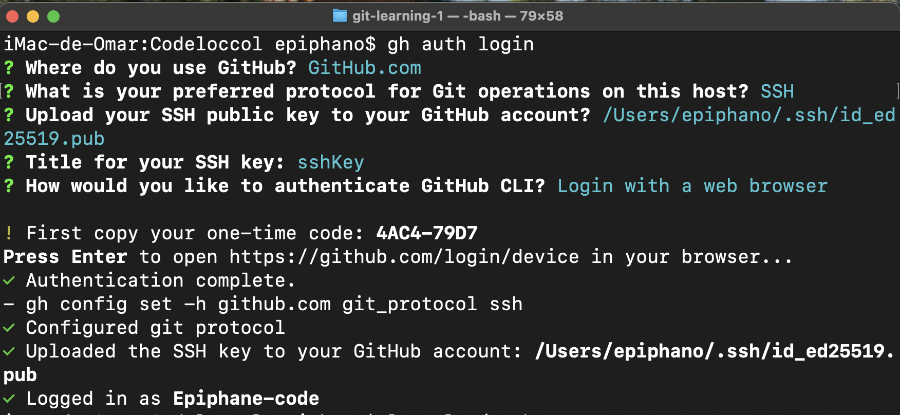

*** ls -al ~/.ssh : pour verifier dans le fichier .ssh si on a deja la clé ssh
*** cat ~/.ssh/id_ed25519.public : 

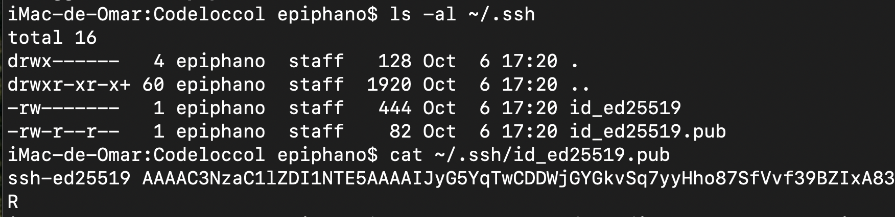

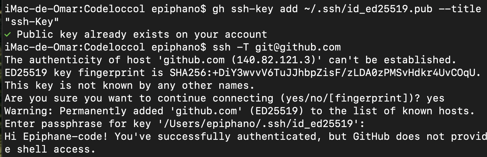

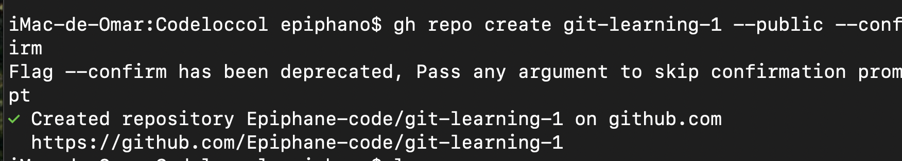

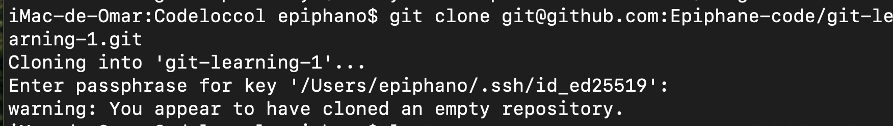

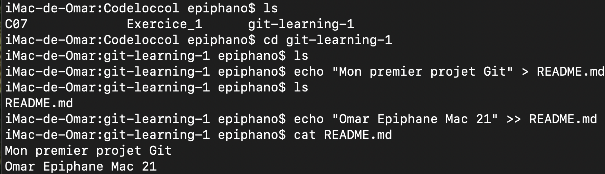

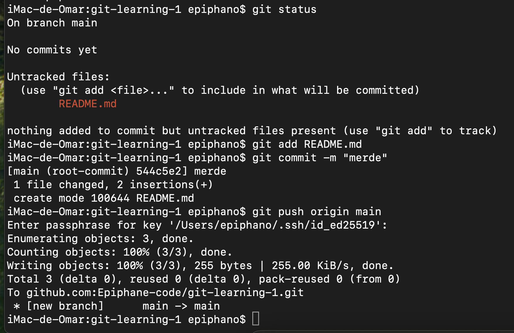

** Exercice N°2:

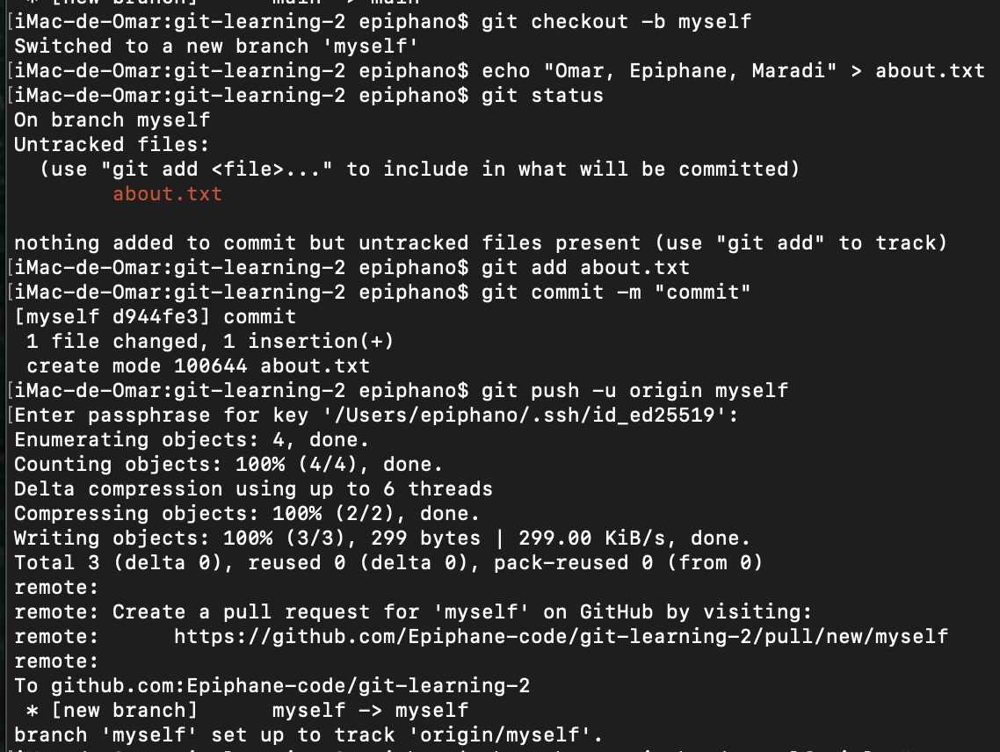

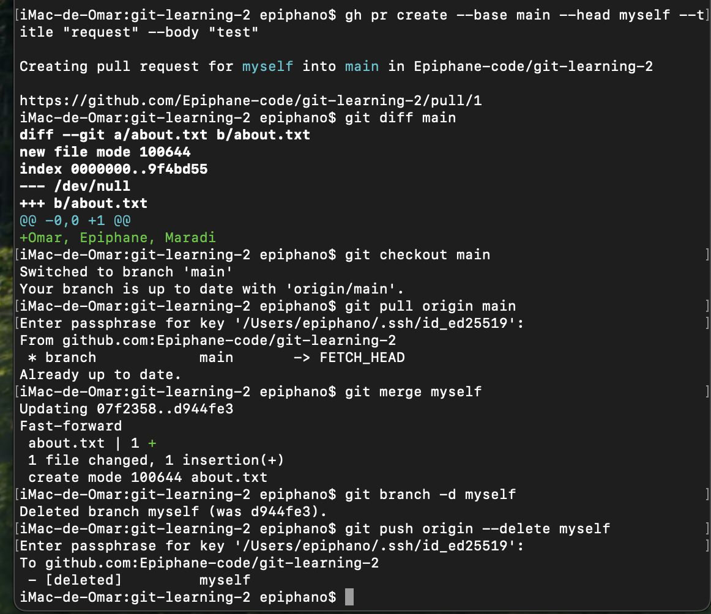

** Exercice N°3

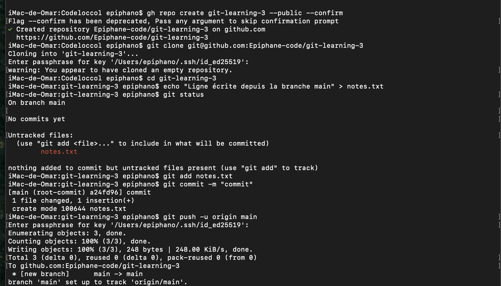

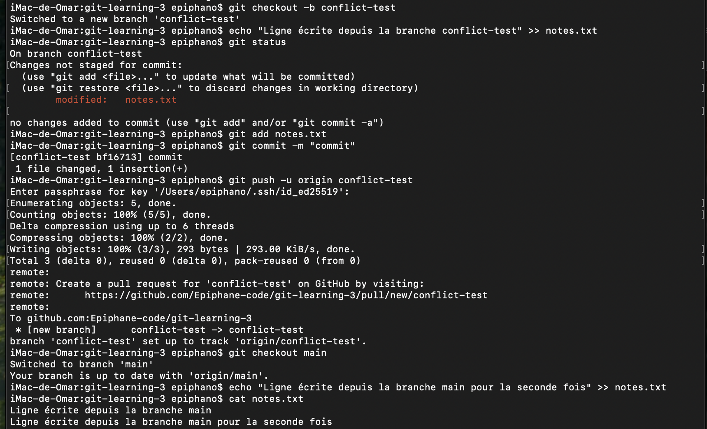

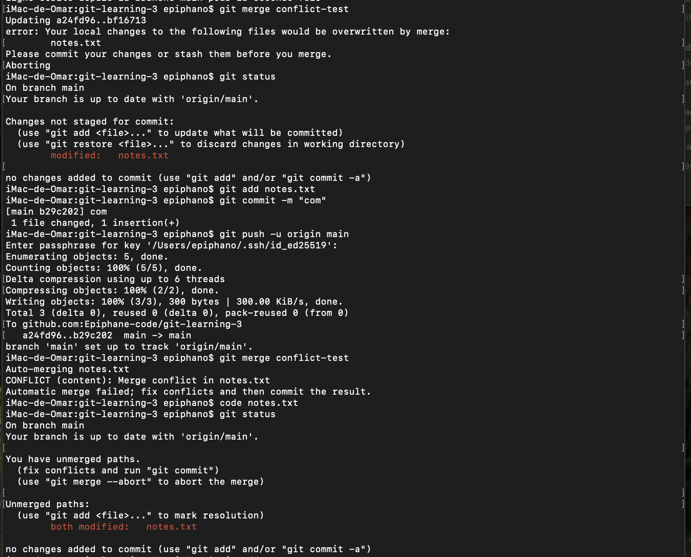

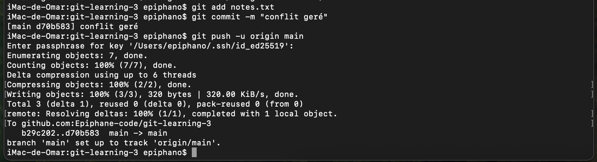

